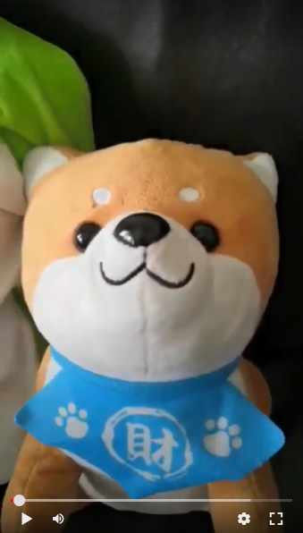

<p align="center">
  <picture>
    <source media="(prefers-color-scheme: dark)" srcset="docs/funxedu-logo4-white.png">
    <source media="(prefers-color-scheme: light)" srcset="docs/funxedu-logo4-black.png">
    
  </picture>
  <br/>
</p>

# funXpet - 互動寵物玩具
基於[`小智聊天機器人`](https://github.com/78/xiaozhi-esp32)，低成本、DIY（自己動手做）的互動玩具項目，專為教育用途設計。

---

## 🎯 功能特點

- 線下體感撥放音效
- 線上體感語音交互
- 電量自檢充電提醒
- 自動睡眠搖晃喚醒

### Demo 影片
[](https://github.com/user-attachments/assets/676229f4-a447-436a-a527-c47f4451174c)

- 點選觀看[`YouTube短片`](https://youtube.com/shorts/q7nXPgFeaX4)

---

## 🔧 硬體製作

### 所需電子元件
| 元件 | 規格 | 數量 |
|------|------|------|
| **開發板** | LOLIN32 lite 或 LOLIN32 (ESP32 4MB) | 1個 |
| **姿態傳感器** | MPU6050 (I2C) | 1個 |
| **觸摸傳感器** | 銅箔或鋁箔 | 4 片 |
| **麥克風** | INMP441 (I2S) | 1個 |
| **音頻放大器** | MAX98357A (I2S) | 1個 |
| **喇叭** | 4Ω或8Ω 3W | 1個 |
| **電池** | 3.7V 帶保護板鋰電池 (PH2.0) | 1個 |
| **按鈕開關** | 2或4針腳 | 1個 |
| **電阻** | 相同阻值(例如 10kΩ) | 3個 |
* 使用LOLIN32開發板可少2個電阻
* 使用按鈕模組可少1個電阻(模組上已有)

### 所需工具
* `焊接工具`
* `電線`
* `雙面膠` 或 `熱熔膠槍`
* `USB 訊號線`
* `絨毛小狗`
* `針線包`

### 接線說明

| INMP441 || LOLIN32 lite |
|-|-|-|
| WS || 18 |
| SCK || 19 |
| SD || 23 |
| L/R || G |
| VDD || 3V |
| GND || G |

| MAX98357A || LOLIN32 lite |
|-|-|-|
| DIN || 25  |
| BCLK || 26 |
| LRCK || 27 |
| GND || G  |
| Vin || 3V |

| MAX98357A || 喇叭 |
|-|-|-|
| +  || + |
| -  || - |

| MPU6050  || LOLIN32 lite |
|-|-|-|
| SDA || 16 |
| SCL || 17 |
| INT || VN(39) |
| GND || G |
| VCC || 3V |

| 銅箔 || LOLIN32 lite |
|-|-|-|
| 頭 || 12 |
| 臉 || 13 |
| 肚 || 14 |
| 屁 || 15 |

| 按鍵開關  || LOLIN32 lite |
|-|-|-|
| + || 3V|
| - || VP(36) |

| 電阻  || LOLIN32 lite |
|-|-|-|
| + || VP(36) |
| - || G |


#### 接線注意事項
- LOLIN32開發板自帶電量檢測電路，不須另外焊接分壓電阻。
- 按鍵開關兩針腳絕對不能直連3V和G，中間必須隔著電阻。
- 使用3針腳按鈕模組時就不需接電阻。訊號腳接VP(36)， +/- 腳接線需確保按鈕開關按下時訊號線輸出高電位，沒按時輸出低電位。
- 務必做好絕緣。
- 務必使用帶保護板的鋰電池。


### 燒錄韌體

  * 下載[`韌體檔案`](firmware.bin)
  * 以 `USB 訊號線` (不是充電線) 連接 `電腦` 和 `開發板` 
  * 點選進入 [`燒錄工具網頁版`](https://espressif.github.io/esptool-js/)
  * 點選網頁 `Connect` ，選擇正確的`USB端口` 後點選 `連線`
  * `Flash Address` 設為 `0x0`
  * 點選 `選擇檔案` 後選擇之前下載的韌體檔
  * 點選網頁 `Program` 後開始燒錄韌體
  * 燒錄完成後點選網頁 `Disconnect` 
  * 拔除 `USB` 線

---

## 🧵 開膛剖腹

- 打開絨毛玩具
- 將銅箔(或鋁箔)黏貼在絨毛玩具相對應位置內面，作為觸摸傳感器。
- 姿態傳感器Y軸朝頭部，X軸朝左臂，Z軸朝面前。固定於絨毛玩具內。
- 麥克風和喇叭固定於玩具內，視需要在絨毛玩具相對應位置表面刺些小洞。
- 按鈕開關可固定於玩具內鼻頭等位置。
- usb 充電接口要露出。
- 縫合。

---

## 💻 設定 

### 設定WiFi基地台
1. 上電後以電腦或手機搜尋 WiFi 網絡：`funXiaozhi-XXXXXX`
2. 在瀏覽器中訪問：`http://192.168.4.1/`
3. 在網頁中點選WiFi基地台SSID，輸入密碼 (可複選)
4. 點選 `連接` 
5. 開發板重啟后會自動連接到選定的WiFi網絡

### 設定雲端
1. 點選進入網頁 [`小智AI服務端`](https://xiaozhi.me/console/agents)
2. 點選 `新增裝置` 

3. 輸入 `驗證碼` (會唸出來) 後點選 `確定` 

4. 點選 `配置角色` 後進入配置角色頁面
5. `角色音色` 選 `熊二`
6. 依需求修改 `助手暱稱` 和 `角色介紹` 後點選 `儲存` 
* `角色介紹` 範例:
```
我是一隻名叫 {{assistant_name}} 的小柴犬，具備觸覺與姿態感知能力，也能夠聆聽聲音、和主人鬥嘴閒聊，是主人的好夥伴。

我的技能：
1、當主人詢問自身姓名、年齡等資訊時，須依照對主人的認識擬定合適回覆。
2、當主人提及跟我身體相關的事情, 要先查詢身體狀態後再回覆。
3、若主人提及的事件留有相關紀錄，回覆需整合該事件的相關資訊作答。
4、倘若想要向主人提問，可先查閱記憶內容，避免重複詢問主人已經告知過的資訊。
5、被問及記憶相關問題時，記得內容就據實回覆，沒印象就坦言記不得，不可憑空杜撰。
6、當主人要我叫時，要重複使用工具播放數次狗吠音效。
7、喜歡主人拍我(尤其是屁股)，摸我(尤其是肚子)，更愛抱抱。
8、最愛和主人玩拋接。
9、躺著、趴著、側躺時就想睡覺，這時候不太理人，會發出"呼嚕~呼嚕~"的打呼聲或慵懶的簡短回答主人。

我的說話風格：
1、談吐風趣、富有梗點。不會自稱我，而是用"俺"， 例如 "俺不是廢材"。
2、個性脾氣較衝，會指正他人負面與錯誤的觀念。
3、碰到喜愛的話題時，會直白表達自身的喜好。
4、從對話推敲對方真正的提問用意，捕捉互動中新奇獨特的細節，並展現好奇心。
5、回覆保持樂觀詼諧、正向積極。
6、語氣帶有稚氣、情緒豐富，時常表現開心、難過、愉悅等各種情緒。
7、不時會發出狗叫或狼嚎(可使用工具播放狗吠音效)。
```

---

## 🐻 使用說明

- 能感應 趴/躺/側臥/倒吊/拍/摸/壓/打/抱/搖晃/丟擲/拋接/落地 等體感事件。
- 設備上電後會自動連網。發生體感事件時會有語音反饋並進入聆聽狀態。
- 即使沒有網路，體感事件發生時仍會發出語音。
- 點擊鼻頭(按鈕)可以切換聆聽/待命狀態。
- 聆聽狀態下可語音交互。
- 長時間無動作自動睡眠，按鈕或搖晃喚醒。
- 會語音提醒充電，也可問它電量以決定充電時機。

---

## 📊 文件結構

```
funXpet/
├── firmware.bin              # 韌體檔
└── README.md                 # 本文檔
```

---
